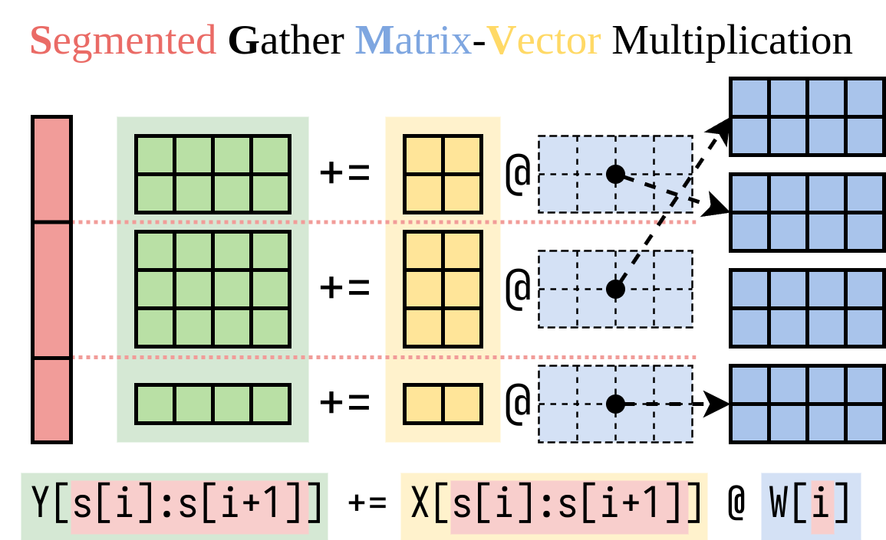
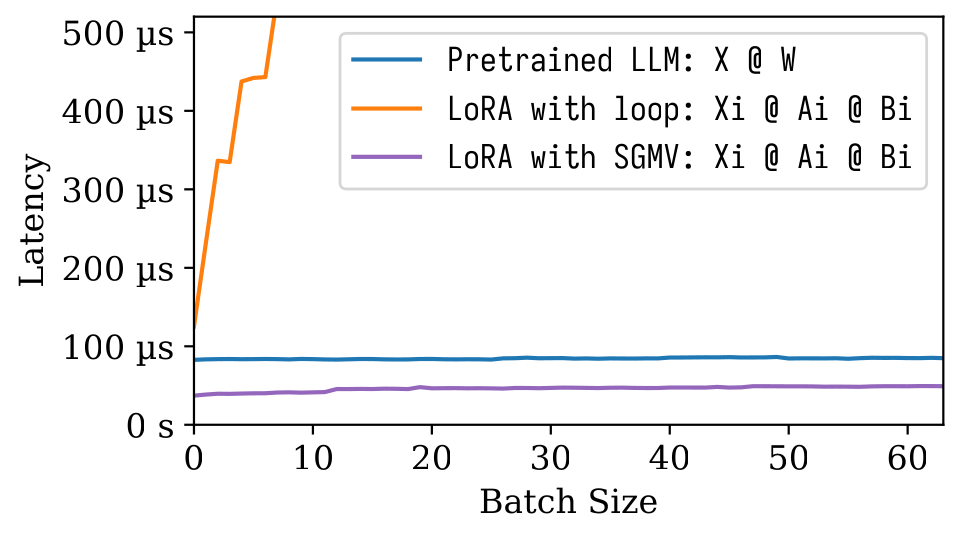
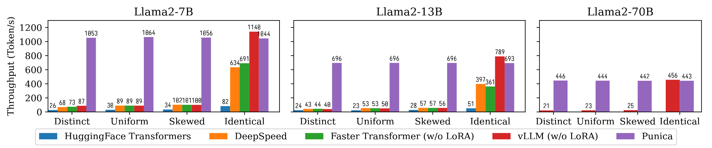

# Punica: Serving multiple LoRA finetuned LLM as one

[(paper)](https://arxiv.org/abs/2310.18547)

## Demo

[punica-tui-demo.webm](https://github.com/punica-ai/punica/assets/2470081/532c6114-9322-4d53-ae88-1d0f44dc960f)

```bash
python examples/tui-multi-lora.py
```

## Overview

[Low rank adapation](https://arxiv.org/abs/2106.09685) (LoRA) is a parameter efficient way to add new knowledge to a pretrained LLM. Although the pretrained LLM takes 100s of GB storage, a LoRA finetuned model only adds 1% storage and memory overhead. Punica enables running multiple LoRA finetuned models at the cost of running one.

How?

Assuming `W` of shape `[H1, H2]` is the weight of the pretrained model, LoRA adds two small matrices `A` of shape `[H1, r]` and `B` of `[r, H2]`. Running a input `x` on the finetuned model would be `y := x @ (W + A@B)`, which is the same as `y := x@W + x@A@B`.

When there are `n` LoRA models, there will be `A1`, `B1`, `A2`, `B2`, ..., `An`, `Bn`.  Given a input batch `X := (x1,x2,...,xn)` that maps to each LoRA model, the output is `Y := X@W + (x1@A1@B1, x2@A2@B2, ..., xn@An@Bn)`. The left-hand-side computes the input batch on the pretrained model. It is quite efficient. The latency is almost the same as when there's only one input, thanks to the strong [batching effect](https://le.qun.ch/en/blog/2023/05/13/transformer-batching/).

We figured out an efficient way to compute the right-hand-side (the LoRA addon). We encapsulate this operation in a CUDA kernel, called Segmented Gather Matrix-Vector multiplication (SGMV), as illustrated below.

<p align="center"></p>

In the following microbenchmark figure, we can observe the strong batching effect of the pretrained model. Naive implementation of LoRA is slow, as depicted in the orange line. LoRA implemented via SGMV is efficient and preserves the strong batching effect.

<p align="center"></p>

The following figure shows the text generation throughput comparison between Punica and other systems, including [HuggingFace Transformers](https://github.com/huggingface/transformers/), [DeepSpeed](https://github.com/microsoft/DeepSpeed), [FasterTransformer](https://github.com/NVIDIA/FasterTransformer), [vLLM](https://github.com/vllm-project/vllm). The benchmark considers different settings of LoRA model popularity. *Distinct* means that each request is for a different LoRA model. *Identical* means that all requests are for the same LoRA model. *Uniform* and *Skewed* are in between. **Punica achieves 12x throughput compared to state-of-the-art systems.**

<p align="center"></p>

Read our paper to understand more: [Punica: Multi-Tenant LoRA Serving](https://arxiv.org/abs/2310.18547).


## Installation

You can install Punica from binary package or build from source.

### Install from binary package

* Pros: No need to compile. Fast to install.
* Cons: Might not match your CUDA version, CUDA architecture, PyTorch version, or Python version.
* Current precompiled versions:
  * CUDA: 11.8, 12.1
  * Python: 3.10, 3.11
  * TORCH_CUDA_ARCH_LIST: `8.0 8.6 8.9+PTX`

```bash
pip install ninja torch
pip install punica -i https://punica-ai.github.io/whl/cu121/ --extra-index-url https://pypi.org/simple
# Note: Change cu121 to your CUDA version.
```

### Build from source

```bash
# Please install torch before punica
pip install ninja numpy torch

# Clone punica
git clone https://github.com/punica-ai/punica.git
cd punica
git submodule sync
git submodule update --init

# If you encouter problem while compilation, set TORCH_CUDA_ARCH_LIST to your CUDA architecture.
# export TORCH_CUDA_ARCH_LIST="8.0"

# Build and install punica
pip install -v --no-build-isolation .
```

## Examples

### Serving multiple LoRA models

See the demo above.

### Finetune & convert to Punica format & serve with Punica

See [`examples/finetune/`](examples/finetune/)

### Benchmark text generation

```bash
python -m benchmarks.bench_textgen_lora --system punica --batch-size 32
```


## Citation

```bibtex
@misc{punica,
    title={Punica: Multi-Tenant LoRA Serving},
    author={Lequn Chen and Zihao Ye and Yongji Wu and Danyang Zhuo and Luis Ceze and Arvind Krishnamurthy},
    year={2023},
    eprint={2310.18547},
    archivePrefix={arXiv},
    primaryClass={cs.DC}
}
```
